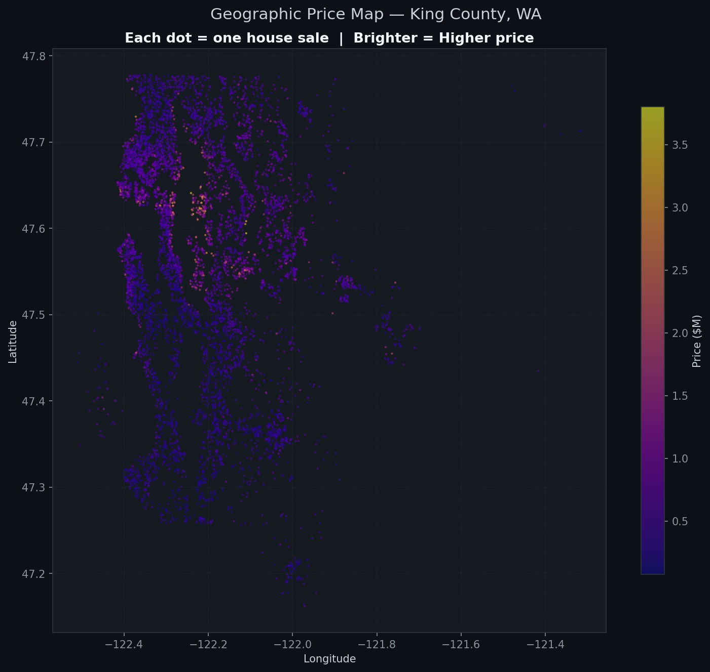
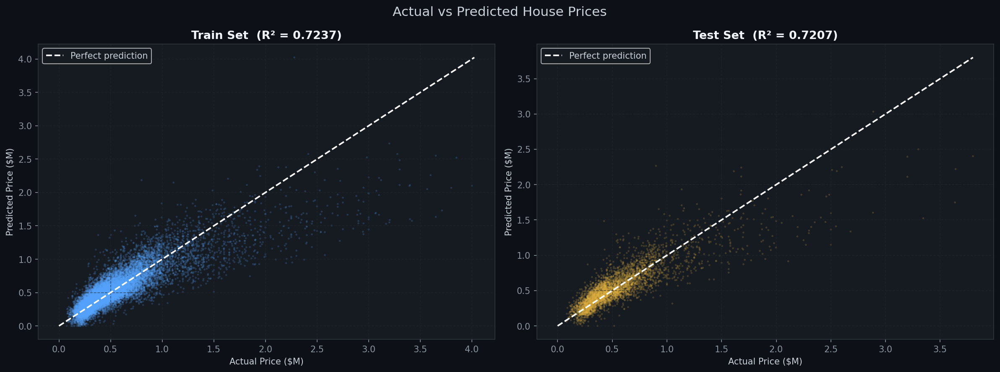
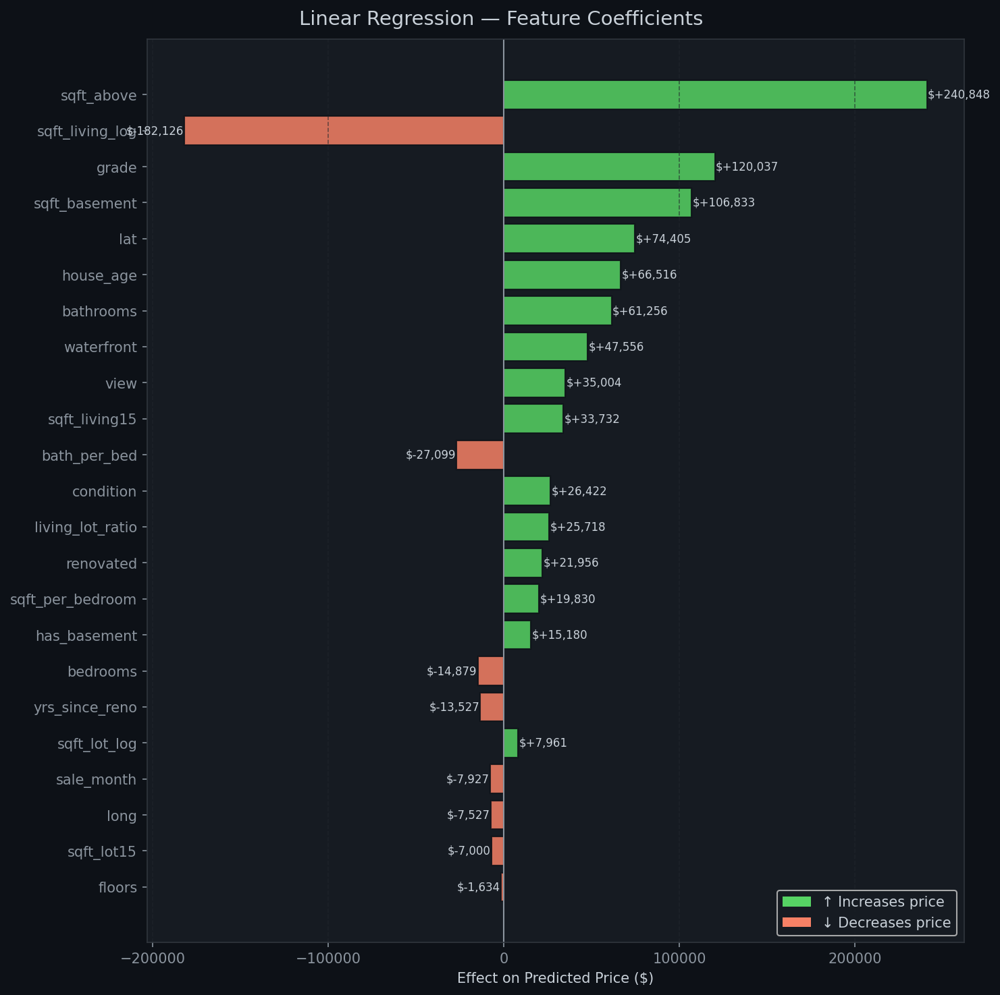
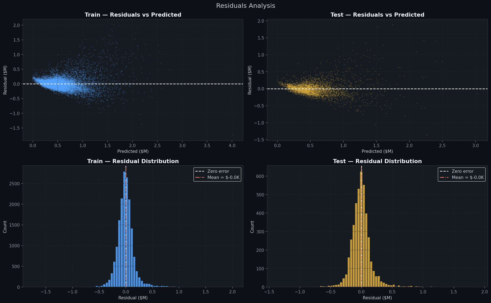
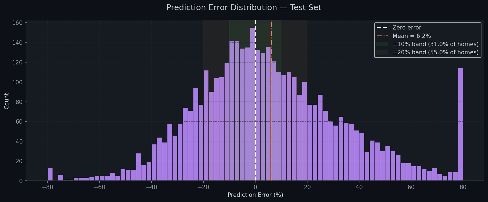

# 🏠 King County House Price Prediction
### Linear Regression on Real Individual House Sales Data

A complete, beginner-to-intermediate Machine Learning project predicting individual house sale prices using **Linear Regression** with feature engineering. Built on the real **King County House Sales** dataset — 21,613 actual house transactions from Seattle, WA.

> ✅ Uses **real individual house records** — not block-group averages  
> ✅ Includes **feature engineering** (9 new features created)  
> ✅ Includes a **geographic price heatmap**  
> ✅ **12 publication-quality visualizations** with dark theme  
> ✅ Fully structured and commented for learning

---

## 📊 Final Results

| Metric | Train | Test |
|--------|-------|------|
| **R² Score** | 0.7237 | 0.7207 |
| **MAE** | $117,189 | $117,847 |
| **RMSE** | $183,477 | $183,242 |
| **Within ±10% error** | — | 31.0% |
| **Within ±20% error** | — | 55.0% |

> The model explains **72.1% of variance** in house prices on unseen test data.  
> Train ≈ Test scores confirm **no overfitting**.

---

## 📁 Project Structure

```
kc-house-price-prediction/
│
├── kc_house_price_prediction.ipynb   # ← Main Jupyter Notebook
├── kc_house_data.csv                 # King County dataset (21,613 rows)
│
├── plot_01_price_distribution.png    # Price histogram, log-transform & box plot
├── plot_02_feature_distributions.png # 8-panel feature histogram grid
├── plot_03_correlation_heatmap.png   # Pearson correlation heatmap (14×14)
├── plot_04_scatter_top_features.png  # Top 4 features vs price scatter plots
├── plot_05_price_by_grade_condition.png # Box plots by grade & condition
├── plot_06_geographic_price_map.png  # Lat/Long scatter coloured by price
├── plot_07_scaling_before_after.png  # StandardScaler before vs after
├── plot_08_coefficients.png          # Feature coefficient bar chart
├── plot_09_metrics_dashboard.png     # Train vs Test metrics comparison
├── plot_10_actual_vs_predicted.png   # Actual vs Predicted scatter
├── plot_11_residuals_analysis.png    # Residuals (2×2 grid)
├── plot_12_error_distribution.png    # % prediction error distribution
│
└── README.md                         # This file
```

---

## 🗂️ Dataset

**Source**: [Kaggle — House Sales in King County, USA](https://www.kaggle.com/datasets/harlfoxem/housesalesprediction)

- **21,613** individual house sales
- **May 2014 – May 2015**, King County, Washington State
- Each row = one real house transaction

| Feature | Type | Description |
|---------|------|-------------|
| `price` | float | **Target** — sale price in USD |
| `bedrooms` | int | Number of bedrooms |
| `bathrooms` | float | Number of bathrooms (0.5 = half-bath) |
| `sqft_living` | int | Interior living area (sq ft) |
| `sqft_lot` | int | Lot area (sq ft) |
| `floors` | float | Number of floors |
| `waterfront` | int | Waterfront property flag (0/1) |
| `view` | int | View quality score (0–4) |
| `condition` | int | Overall condition (1–5) |
| `grade` | int | King County grade system (1–13) |
| `sqft_above` | int | Above-ground sq ft |
| `sqft_basement` | int | Basement sq ft |
| `yr_built` | int | Year built |
| `yr_renovated` | int | Year renovated (0 = never) |
| `zipcode` | int | ZIP code |
| `lat` / `long` | float | GPS coordinates |
| `sqft_living15` | int | Avg living sqft of 15 nearest neighbours |
| `sqft_lot15` | int | Avg lot sqft of 15 nearest neighbours |

---

## ⚙️ Feature Engineering

9 new features were created from the raw data:

| New Feature | Formula | Why It Helps |
|-------------|---------|--------------|
| `house_age` | `sale_year − yr_built` | Newer homes tend to sell for more |
| `renovated` | 1 if `yr_renovated > 0` | Renovated homes command a premium |
| `yrs_since_reno` | `sale_year − yr_renovated` | Recent renos add more value |
| `has_basement` | 1 if `sqft_basement > 0` | Binary basement indicator |
| `sqft_per_bedroom` | `sqft_living ÷ bedrooms` | Space quality per room |
| `bath_per_bed` | `bathrooms ÷ bedrooms` | Luxury indicator |
| `living_lot_ratio` | `sqft_living ÷ sqft_lot` | How much lot is built on |
| `sqft_living_log` | `log(1 + sqft_living)` | Reduces right skew |
| `sqft_lot_log` | `log(1 + sqft_lot)` | Reduces right skew |

---

## 🔬 Project Workflow

```
Load Data
    ↓
Clean Data (drop ID, parse date, remove outliers)
    ↓
Feature Engineering (9 new features)
    ↓
Exploratory Data Analysis (6 plot types)
    ↓
Train/Test Split (80/20)
    ↓
StandardScaler (fit on train only)
    ↓
Linear Regression (OLS)
    ↓
Evaluation (R², MAE, MSE, RMSE, % error bands)
    ↓
Visualizations (Actual vs Predicted, Residuals, Error %)
```

---

## 🖼️ Sample Visualizations

### Geographic Price Map


### Actual vs Predicted


### Feature Coefficients


### Residuals Analysis


### Prediction Error Distribution


---

## 🧠 Key Findings

| Finding | Detail |
|---------|--------|
| **`grade` is king** | King County's quality grade is the #1 price driver — more impactful than raw size |
| **Location matters** | `lat`/`long` have strong correlation — northern KC commands premium prices |
| **Size drives value** | `sqft_living` and `sqft_above` are top 3 predictors |
| **Waterfront premium** | Only 0.7% of homes are waterfront, but they command massive premiums |
| **No overfitting** | Train R² (0.7237) ≈ Test R² (0.7207) — model generalises well |
| **Linear limits** | Residuals fan out at high prices — non-linear models would help |

---

## 🚀 Getting Started

### Prerequisites
- Python 3.8+
- Jupyter Notebook or JupyterLab

### Installation

```bash
# 1. Clone the repo
git clone https://github.com/Datta-6699/Housing-Price-Prediction.git
cd Housing-Price-Prediction

# 2. (Recommended) Create a virtual environment
python -m venv .venv
source venv/bin/activate        # Linux/Mac
.venv\Scripts\activate           # Windows

# 3. Install dependencies
pip install numpy pandas matplotlib scikit-learn notebook

# 4. Launch Jupyter
jupyter notebook kc_house_price_prediction.ipynb
```

### Dependencies

| Package | Version | Purpose |
|---------|---------|---------|
| `numpy` | ≥ 1.21 | Numerical operations |
| `pandas` | ≥ 1.3 | Data loading, cleaning, engineering |
| `matplotlib` | ≥ 3.4 | All 12 visualizations |
| `scikit-learn` | ≥ 1.0 | Preprocessing, model, metrics |
| `notebook` | ≥ 6.0 | Run the `.ipynb` file |

---

## 📈 Possible Improvements

| Improvement | Expected Gain |
|-------------|---------------|
| Log-transform the target `log(price)` | +3–5% R² |
| One-hot encode `zipcode` (70 unique) | +2–4% R² |
| Polynomial features (`grade²`, `sqft²`) | +2–3% R² |
| Ridge / Lasso Regression | Better handling of correlated features |
| **Random Forest** | Push R² above 0.87 |
| **XGBoost / LightGBM** | State-of-art for tabular data (R² > 0.90) |
| K-Fold Cross Validation | More reliable performance estimate |
| Hyperparameter tuning (`GridSearchCV`) | Optimal model settings |

---

## 📚 What You Will Learn

After working through this notebook you will understand:

- ✅ How to clean and prepare **real-world housing data**
- ✅ How to engineer **meaningful new features** from raw columns
- ✅ How to perform thorough **EDA** including geographic visualisation
- ✅ Why and how to apply **log transformations** to skewed data
- ✅ How to prevent **data leakage** when scaling features
- ✅ How to interpret **Linear Regression coefficients** in dollar terms
- ✅ How to evaluate a model with **R², MAE, MSE, RMSE and % error bands**
- ✅ How to read **residual plots** and understand their implications

---

## 🙏 Acknowledgements

- **Dataset**: [Kaggle — House Sales in King County, USA](https://www.kaggle.com/datasets/harlfoxem/housesalesprediction)
- Original data collected from King County Department of Assessments

---

*Built with ❤️ using Python · Pandas · NumPy · Matplotlib · Scikit-learn*
